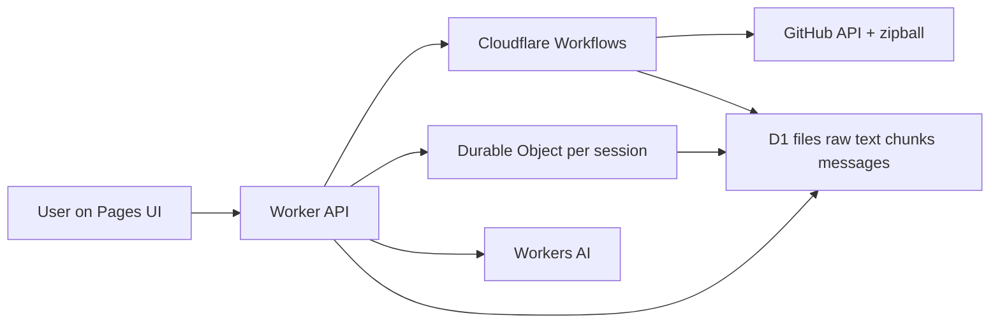

# Repo Explainer

Cloudflare-native demo app for chatting with a public GitHub repo. A user pastes a repo URL, the app indexes the codebase with a Workflow, generates a grounded overview, and answers follow-up questions with file-path citations and persistent session state.

## What It Does

- Accepts a public GitHub repository URL, plus optional branch and subdirectory.
- Runs a Cloudflare Workflow to fetch the repo, filter files, chunk source text, and build a repo overview.
- Stores repo metadata, raw file text, chunks, and chat history in D1, with live session memory/state in a Durable Object.
- Exposes a Worker API for session lifecycle, repo status, history, and chat answers.
- Renders a React frontend intended for Cloudflare Pages deployment.

## Architecture



## Why These Cloudflare Products

- Pages: lightweight deployment target for the React UI.
- Worker: API routes, orchestration entrypoint, retrieval, and LLM calls.
- Workflows: visible, durable indexing pipeline with distinct session states.
- Durable Objects: per-session coordination, memory, and serialized chat updates.
- D1: metadata store for sessions, raw file text, chunks, FTS, overviews, and message history.
- Workers AI: repo overview generation and grounded answer generation.

## Repo Ingestion

1. Validate and parse the GitHub URL.
2. Resolve default branch and commit SHA through the GitHub API.
3. Fetch the recursive file tree and apply source-oriented filtering.
4. Download the repo zipball at the resolved commit.
5. Extract only the selected files, persist raw file text and chunk metadata into D1.

Filtering intentionally excludes vendored output, lockfiles, binaries, oversized files, and generated assets. The default caps are 300 files, 6 MB total indexed text, and 200 KB per file.

## Retrieval

- Each chunk is stored in D1 and mirrored into an FTS5 table.
- Queries use lexical retrieval, path/file-name boosting, and direct file matching when the user names files explicitly.
- Answers always return citations with file paths and line ranges from the retrieval evidence.
- If evidence is weak, the response says so instead of pretending certainty.

## Session Memory

- Session status lives in the `sessions` table and is mirrored into a per-session Durable Object snapshot.
- Chat history is persisted in D1.
- The Durable Object tracks focus areas, last referenced files, and a short rolling memory summary so follow-up questions can stay contextual without replaying the entire chat.

## Local Development

Prerequisites:

- Node 22+
- `pnpm`
- A Cloudflare account for D1/Workflows/AI bindings

Install:

```bash
pnpm install
```

Configure:

1. Replace the placeholder D1 database ID in `apps/api/wrangler.jsonc`.
2. Copy `apps/api/.dev.vars.example` to `apps/api/.dev.vars` and optionally set `GITHUB_TOKEN`.
3. Copy `apps/web/.env.example` to `apps/web/.env` and set `VITE_API_BASE_URL` to your Worker dev URL.
4. Apply D1 migrations:

```bash
pnpm --filter @repo-explainer/api migrate:local
```

Run:

```bash
pnpm dev:api
pnpm dev:web
```

The API uses `wrangler dev --remote` because Workflows are not locally simulated.

## Verification

```bash
pnpm typecheck
pnpm build
pnpm test
```

## Tradeoffs

- Public GitHub repos only in v1.
- Retrieval is lexical/path-aware rather than embedding-based to keep the architecture narrow and inspectable.
- One repo per session, with no cross-session index deduping yet.
- Chat answers are returned as a single JSON payload instead of token streaming so citations arrive atomically.

## Future Improvements

- Add onboarding mode and recent-change summaries.
- Add cross-session repo deduping and repo-level caching.
- Add richer compare-mode prompts and answer formatting.
- Add deployment scripts for provisioning D1 resources automatically.
